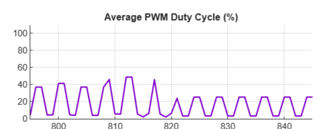
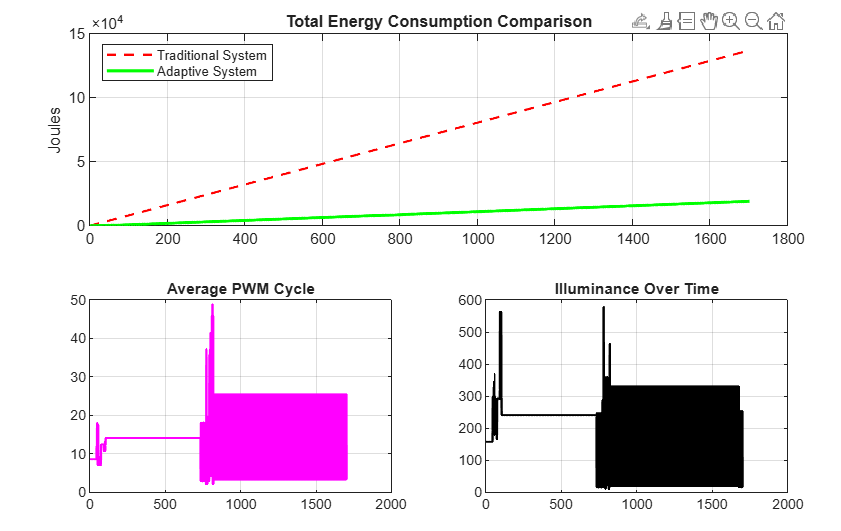
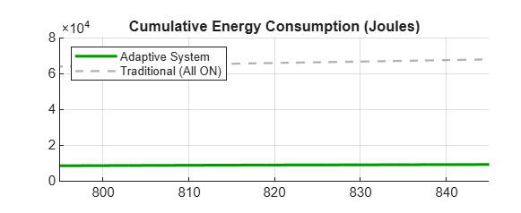
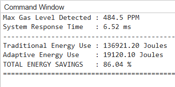
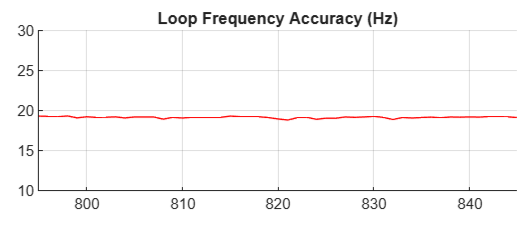
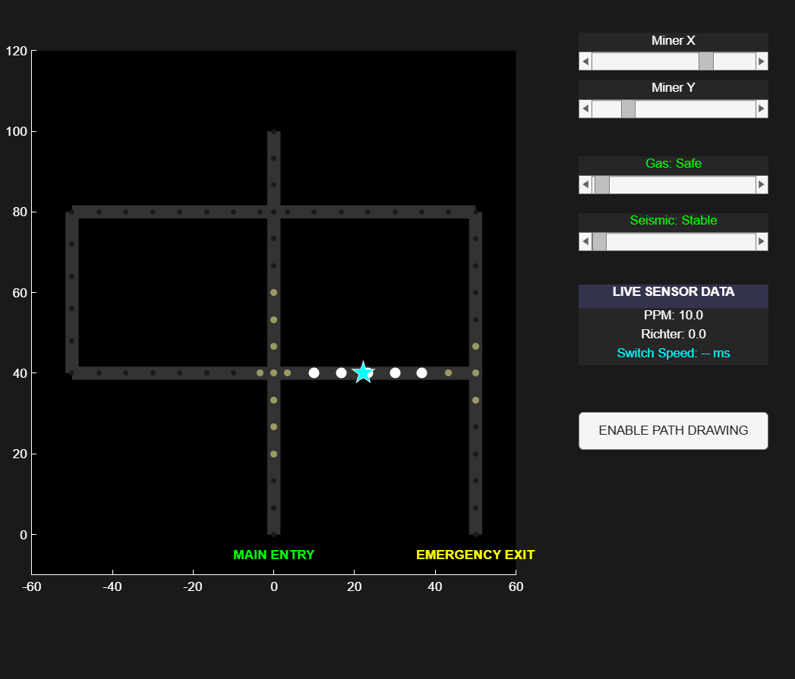

# LuminaResc – Mine Safety System

## Problem
Miners face delayed evacuation during emergencies like gas leaks and seismic activity due to poor visibility and lack of clear guidance paths.

## Solution
LuminaResc uses a smart LED guidance system that dynamically adjusts brightness based on the miner’s distance, creating a clear and energy-efficient evacuation path.

## Features
- Distance-based LED brightness control
- Gas and seismic hazard detection (simulated)
- Energy-efficient adaptive lighting system

## Methodology
- Miner movement is simulated in MATLAB along a predefined path
- Distance between miner and LEDs is continuously calculated
- LED brightness is adjusted inversely with distance:
  - Close (<20m): High brightness  
  - Medium (20–40m): Moderate brightness  
  - Far (>40m): Low brightness  
- Hazard conditions (gas/seismic) trigger the guided path lighting system

## Results
- Reduced evacuation decision time in simulations through clear path indication  
- Improved visibility by dynamically increasing LED intensity near the miner  
- Lower energy consumption compared to static full-brightness lighting  

## 📊 Simulation Outputs

<table>
<tr>
<td align="center"><b>Avg PWM vs Distance</b> </td>
<td align="center"><b>Battery Life</b> </td>
</tr>

<tr>
<td align="center"><b>Energy Consumption</b> </td>
<td align="center"><b>Cumulative Energy</b> </td>
</tr>

<tr>
<td align="center"><b>Energy Saving Results</b> </td>
<td align="center"><b>Loop Frequency Accuracy</b> </td>
</tr>

<tr>
<td align="center"><b>Lux at Miner</b> </td>
<td align="center"><b>GUI Output</b> </td>
</tr>
</table>

## Demo
Watch the demo video:  
https://drive.google.com/file/d/1VvvaMlyFApfpumbpQMZ2Z2RuzVh48vud/view?usp=drivesdk

## Project Structure
- `/matlab` – src.m
- `/images` – Graphs and diagrams  
- `/docs` – Project documentation  

## Future Work
- Real-time miner tracking using IoT  
- Integration with live sensor data  
- Mobile alert system for emergency detection
