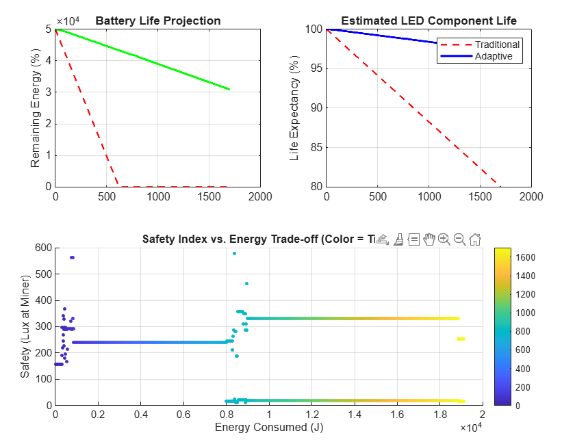
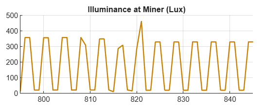

# LuminaResc – Mine Safety System

## Problem
Miners face delayed evacuation during emergencies like gas leaks and seismic activity due to poor visibility and lack of clear guidance paths.

## Solution
LuminaResc uses a smart LED guidance system that dynamically adjusts brightness based on the miner’s distance, creating a clear and energy-efficient evacuation path.

## Features
- Distance-based LED brightness control
- Gas and seismic hazard detection (simulated)
- Energy-efficient adaptive lighting system

## Methodology
- Miner movement is simulated in MATLAB along a predefined path
- Distance between miner and LEDs is continuously calculated
- LED brightness is adjusted inversely with distance:
  - Close (<20m): High brightness  
  - Medium (20–40m): Moderate brightness  
  - Far (>40m): Low brightness  
- Hazard conditions (gas/seismic) trigger the guided path lighting system

## Results
- Reduced evacuation decision time in simulations through clear path indication  
- Improved visibility by dynamically increasing LED intensity near the miner  
- Lower energy consumption compared to static full-brightness lighting  

## 📊 Simulation Outputs

### 🔹 Distance vs Brightness Control
Demonstrates adaptive LED intensity based on miner distance, ensuring visibility while minimizing power usage.  
Result: Brightness decreases smoothly with distance, maintaining efficiency without compromising safety.

---

### 🔹 Battery Performance
Analyzes battery discharge under adaptive lighting conditions.  
Result: Slower discharge rate compared to continuous full-brightness operation, improving system longevity.

---

### 🔹 Energy Consumption Analysis
Compares energy usage between adaptive lighting and traditional static lighting.  
Result: Adaptive system significantly reduces unnecessary power consumption during low-risk conditions.

---

### 🔹 Cumulative Energy Usage
Tracks total energy consumption over time.  
Result: Lower cumulative energy usage confirms long-term efficiency benefits of the system.

---

### 🔹 Energy Savings Results
Quantifies total energy saved using the proposed system.  
Result: Noticeable overall energy savings achieved through distance-based brightness control.

---

### 🔹 Loop Frequency Accuracy
Validates system timing and responsiveness.  
Result: Stable loop frequency ensures reliable real-time performance without delays.

---

### 🔹 Illumination at Miner Position
Shows variation of light intensity at the miner’s position.  
Result: Consistent illumination maintained, ensuring safe navigation in low-visibility conditions.

---

### 🔹 System Visualization (GUI Output)
Graphical simulation of miner movement and adaptive LED guidance.  
Result: Clearly illustrates path guidance and dynamic lighting adjustments in real-time.

---

## 🎥 Demo
Watch the system in action:  
👉 https://drive.google.com/your-demo-link-here

## Project Structure
- `/matlab` – src.m
- `/images` – Graphs and diagrams  
- `/docs` – Project documentation  

## Future Work
- Real-time miner tracking using IoT  
- Integration with live sensor data  
- Mobile alert system for emergency detection
